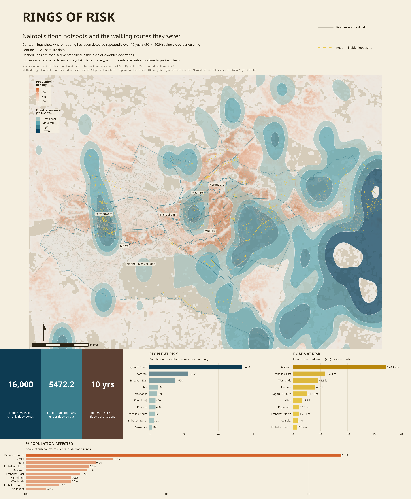

# CRUM FloodMapper

## Overview
CRUM FloodMapper is a lightweight, reproducible workflow designed to help Nairobi (and other cities) visualise long‑term flooding patterns using 10 years of Sentinel‑1 satellite radar (SAR) flood detections from the Microsoft AI for Good lab.
... [previous content] ...

Because around 60% of people in Nairobi walk, understanding which roads flood repeatedly is essential for climate‑resilient urban mobility. This project turns global SAR data into evidence‑based flood maps, helping planners and communities see where chronic flooding intersects with population and road networks.

## What This Workflow Does
CRUM FloodMapper takes the raw SAR flood detections and:

- Cleans the data using filters for slope, soil moisture, temperature, bare ground, and tile-edge artefacts.
- Calculates flood recurrence (how many months each location flooded over 10 years).
- Uses KDE (Kernel Density Estimation) to create smooth "rings of risk" that show clear flood hotspots.
- Overlays roads, sub‑counties, and population data to measure:
  - where flooding recurs
  - which roads are repeatedly affected
  - how many people live inside these risk zones

The result is an intuitive, high‑resolution picture of flood exposure in Nairobi.

## Interactive App[STILL NOT IMPLEMENTED]
An interactive app is included so users can:

- adjust the flood‑detection filters
- change the recurrence threshold
- generate different flood‑risk scenarios
- explore how each choice affects the map

This makes the analysis hands‑on, transparent, and adaptable for different planning questions.

## Data Sources

- **AI for Good SAR Flood Dataset (2014–2024)** — flood detections
- **WorldPop population (100 m)** — population exposure
- **OpenStreetMap** — road networks
- **GADM Level 2 boundaries** — administrative areas

## Outputs

- Flood recurrence "rings of risk" map
- Population exposure summary
- Road‑at‑risk layers
- Sub‑county statistics
- Multiple map styles (light, dark, high‑contrast)

## Limitations

- SAR may miss floods in dense urban areas (radar shadow).
- Filters were calibrated globally, not specifically for Nairobi.
- No ground‑truth validation included.

## Further Reading
For an in‑depth explanation and narrative walkthrough, see the Medium article:
👉 https://medium.com/@stacyfuende/a-decade-of-flooding-in-nairobi-a-deep-dive-into-sar-based-urban-flood-mapping-ed7a21f9f38b

## Contact
Stacy Mwangi

Email: stacyfuende@gmail.com

## License
Educational use only.
